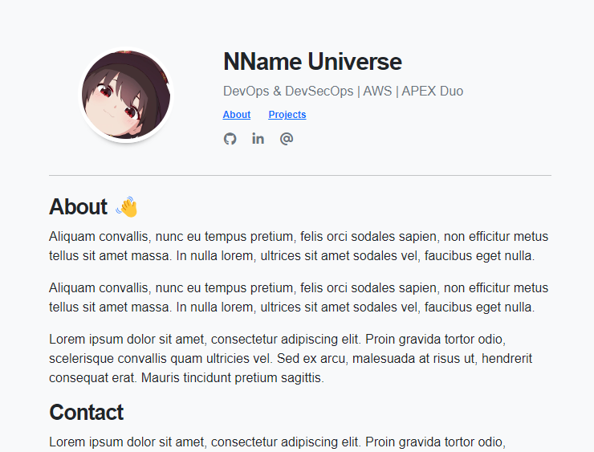

# Universe Starter Kit: Basics

```sh
npm install or pnpm install
```
> **¡Vista previa!** 



## 🚀 Estructura del proyecto

Dentro del proyecto verás la siguiente estructura

```text
/
├── public/
│   ├── pictures/
│   └── favicon.svg
├── src/
│   ├── components/
│   │   ├── Card.astro
│   │   ├── Carousel.astro
│   │   ├── Footer.astro
│   │   └── Header.astro
│   ├── layouts/
│   │   └── Layout.astro
│   └── pages/
│       ├── index.astro
│       └── projects.astro
└── package.json
```
Aquí te dejo los comando basicos directamente de la documentación de astro:

Astro looks for `.astro` or `.md` files in the `src/pages/` directory. Each page is exposed as a route based on its file name.

There's nothing special about `src/components/`, but that's where we like to put any Astro/React/Vue/Svelte/Preact components.

Any static assets, like images, can be placed in the `public/` directory.

## 🧞 Comandos

All commands are run from the root of the project, from a terminal:

| Command                   | Action                                           |
| :------------------------ | :----------------------------------------------- |
| `npm install`             | Installs dependencies                            |
| `npm run dev`             | Starts local dev server at `localhost:4321`      |
| `npm run build`           | Build your production site to `./dist/`          |
| `npm run preview`         | Preview your build locally, before deploying     |
| `npm run astro ...`       | Run CLI commands like `astro add`, `astro check` |
| `npm run astro -- --help` | Get help using the Astro CLI                     |

## 👀 ¿Quieres aprender más?

Puedes revisar  [la documentación](https://docs.astro.build) o chequear en su [Discord server](https://astro.build/chat).
